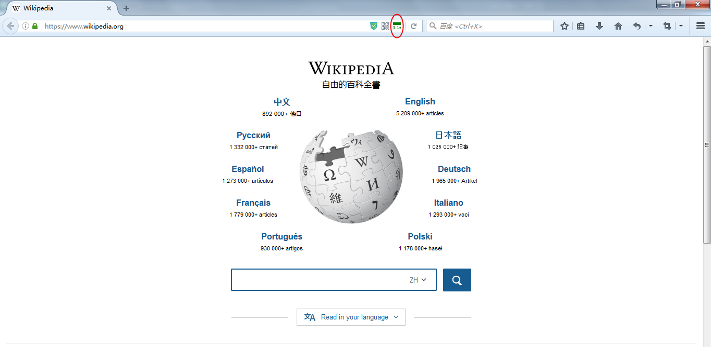

# PageTimer

## What it does

PageTimer is an extension for Firefox that measures page loading time and shows in the address bar.

## What it looks like

When a page loads fast, show a green icon with loading time:

When a page loads slow, show a red icon with loading time:

